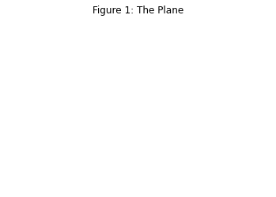
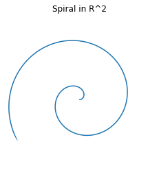
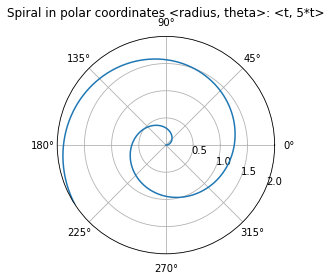
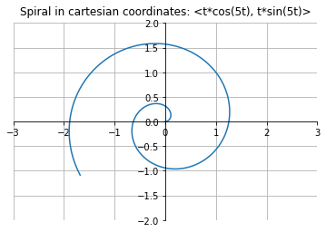
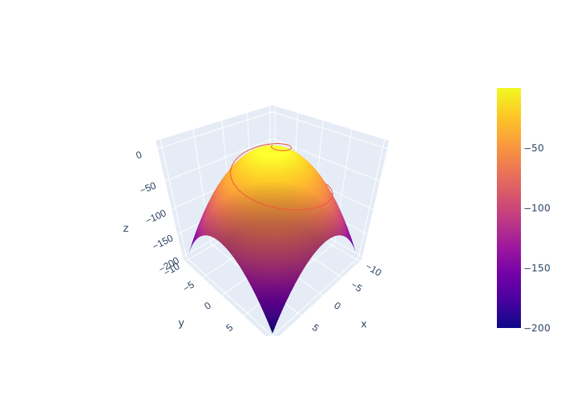

# Section A

Let's discuss manifolds. We're going to be pictoral and stay mostly with this, then we're going to get specific and examine some of these ideas in lcoal coordinates, symbolically. We will come right up to, but won't explciitly define, curvature. 

# Let's discuss it

$$
c = \sqrt{a^2 + b^2}
$$

```python
import sys
!{sys.executable} -m pip install kaleido
```

# Utlity scripts for plotly

<details><summary markdown="span">Let's see some code!</summary>
    
```python
print('Hello World!')
```
Of course, it has to be Hello World, right?
</details>
<br/>

These examples use the python version of plotly in a collab notebook. Here are some convenience functions I wrote you can copy to make things easier. All code examples below call these convenience functions 


<details><summary markdown="span">Expand convenience functions</summary>

```python
# utility code for dif geo examples in python/plotly

def prettify(fig):
  fig.update_layout(scene = dict(
                    #bgcolor='rgb(0,0,0,0)',
                    xaxis = dict(
                         visible=False,
                          showticklabels=False,
                          showaxeslabels=False,
                          backgroundcolor="rgba(255, 255, 255,1)",
                          gridcolor="white",
                          showbackground=True,
                          zerolinecolor="white",
                        showgrid=False),
                    yaxis = dict(
                        visible=False,
                        showticklabels=False,
                        backgroundcolor="rgba(255, 255, 255,1)",
                        showgrid=False),
                    zaxis = dict(
                        visible=False,
                        showticklabels=False,
                        backgroundcolor="rgba(255, 255, 255,1)",
                        showgrid=False,
                        ),),
                    width=700,
                    margin=dict(r=10, l=10, b=10, t=10),
                    
                      paper_bgcolor='rgba(255,255,255,1)',
                       plot_bgcolor='rgba(0,0,0,1)',
             
                  )
  fig.update_coloraxes(showscale=False)
  return fig
    
def SVGConfig():
  config = {
  'toImageButtonOptions': {
    'format': 'svg', # one of png, svg, jpeg, webp
    'filename': 'custom_image',
    'scale': 1 # Multiply title/legend/axis/canvas sizes by this factor
  }
  }
  return config
```

</details>

# Chart spaces and trajectories

a


    


manifold
    

    
is


    


something



<details><summary markdown="span">Code to generate the images in this section</summary>
    
```python
import numpy as np
import matplotlib.pyplot as plt

# Prepare arrays x, y, z
t = np.linspace(0, 2, 1000)
r = t
theta = 5*t

#Just R^2
ax = plt.figure().add_subplot()
ax.plot(0, 0)
plt.axis('off')
ax.set_title("Figure 1: The Plane", va='bottom')

#no grid
fig, ax = plt.subplots(subplot_kw={'projection': 'polar'})
ax.plot(theta, r)
ax.set_rmax(2)
ax.set_rticks([0.5, 1, 1.5, 2])  # Less radial ticks
ax.set_rlabel_position(-22.5)  # Move radial labels away from plotted line
ax.grid(False)
plt.axis('off')
ax.set_title("Spiral in R^2", va='bottom')

#grid
fig, ax = plt.subplots(subplot_kw={'projection': 'polar'})
ax.plot(theta, r)
ax.set_rmax(2)
ax.set_rticks([0.5, 1, 1.5, 2])  # Less radial ticks
ax.set_rlabel_position(-22.5)  # Move radial labels away from plotted line
ax.grid(True)
ax.set_title("Spiral in polar coordinates <radius, theta>: <t, 5*t>", va='bottom')

ax = plt.figure().add_subplot()
t = np.linspace(0, 2, 1000)
x= t*np.cos(5*t)
y= t*np.sin(5*t)
#fig, ax = plt.subplots()
ax.plot(x, y)
ax.spines['left'].set_position('zero')
ax.spines['right'].set_color('none')
ax.spines['bottom'].set_position('zero')
ax.spines['top'].set_color('none')

ax.set(xlim=(-3, 3))
ax.set(ylim=(-2, 2))
ax.grid(True)
ax.set_title("Spiral in cartesian coordinates: <t*cos(5t), t*sin(5t)>", va='bottom')

plt.show()
```
    
</details>
    
# Surface and Curve



So we can draw our manifold from a chart. And we can draw a curve in cartesian space, and use the inverse chart map to lift the curve to lie on the manifold.

