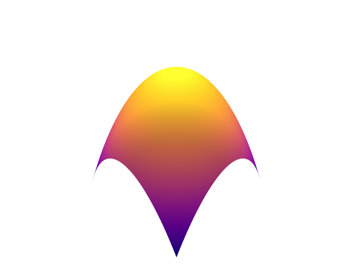
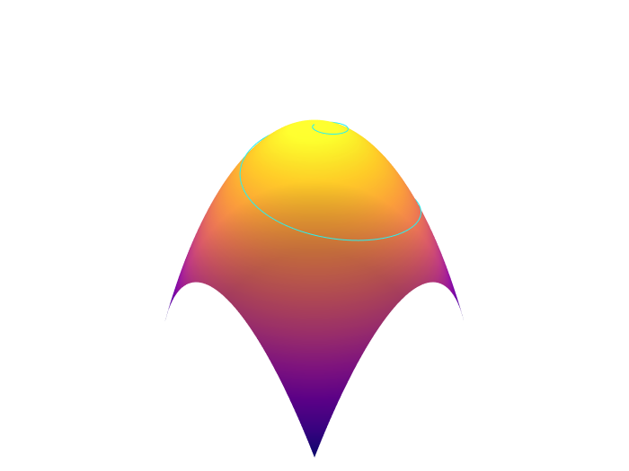
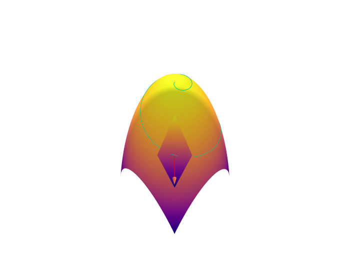

# Manifolds, trajectories, tangent spaces, and intro to parallel transport

Let's discuss manifolds. We're going to be pictoral and stay mostly with this, then we're going to get specific and examine some of these ideas in lcoal coordinates, symbolically. We will come right up to, but won't explciitly define, curvature. 

# Utlity scripts for plotly

These examples use the python version of plotly in a collab notebook. Here are some convenience functions I wrote you can copy to make things easier. All code examples below call these convenience functions 


<details><summary markdown="span">Expand convenience functions</summary>

```python
# utility code for dif geo examples in python/plotly

def prettify(fig):
  fig.update_layout(scene = dict(
                    #bgcolor='rgb(0,0,0,0)',
                    xaxis = dict(
                         visible=False,
                          showticklabels=False,
                          showaxeslabels=False,
                          backgroundcolor="rgba(255, 255, 255,1)",
                          gridcolor="white",
                          showbackground=True,
                          zerolinecolor="white",
                        showgrid=False),
                    yaxis = dict(
                        visible=False,
                        showticklabels=False,
                        backgroundcolor="rgba(255, 255, 255,1)",
                        showgrid=False),
                    zaxis = dict(
                        visible=False,
                        showticklabels=False,
                        backgroundcolor="rgba(255, 255, 255,1)",
                        showgrid=False,
                        ),),
                    width=700,
                    margin=dict(r=10, l=10, b=10, t=10),
                    
                      paper_bgcolor='rgba(255,255,255,1)',
                       plot_bgcolor='rgba(0,0,0,1)',
             
                  )
  fig.update_coloraxes(showscale=False)
  fig.update_layout(showlegend=False)
  return fig
    
def SVGConfig():
  config = {
  'toImageButtonOptions': {
    'format': 'svg', # one of png, svg, jpeg, webp
    'filename': 'custom_image',
    'scale': 1 # Multiply title/legend/axis/canvas sizes by this factor
  }
  }
  return config
```

</details>

# Chart spaces and trajectories

a


    


manifold
    

    
is


    


something


<details><summary markdown="span">Code to generate the images in this section</summary>
    
```python
import numpy as np
import matplotlib.pyplot as plt

# Prepare arrays x, y, z
t = np.linspace(0, 2, 1000)
r = t
theta = 5*t

#Just R^2
ax = plt.figure().add_subplot()
ax.plot(0, 0)
plt.axis('off')
ax.set_title("Figure 1: The Plane", va='bottom')

#no grid
fig, ax = plt.subplots(subplot_kw={'projection': 'polar'})
ax.plot(theta, r)
ax.set_rmax(2)
ax.set_rticks([0.5, 1, 1.5, 2])  # Less radial ticks
ax.set_rlabel_position(-22.5)  # Move radial labels away from plotted line
ax.grid(False)
plt.axis('off')
ax.set_title("Spiral in R^2", va='bottom')

#grid
fig, ax = plt.subplots(subplot_kw={'projection': 'polar'})
ax.plot(theta, r)
ax.set_rmax(2)
ax.set_rticks([0.5, 1, 1.5, 2])  # Less radial ticks
ax.set_rlabel_position(-22.5)  # Move radial labels away from plotted line
ax.grid(True)
ax.set_title("Spiral in polar coordinates <radius, theta>: <t, 5*t>", va='bottom')

ax = plt.figure().add_subplot()
t = np.linspace(0, 2, 1000)
x= t*np.cos(5*t)
y= t*np.sin(5*t)
#fig, ax = plt.subplots()
ax.plot(x, y)
ax.spines['left'].set_position('zero')
ax.spines['right'].set_color('none')
ax.spines['bottom'].set_position('zero')
ax.spines['top'].set_color('none')

ax.set(xlim=(-3, 3))
ax.set(ylim=(-2, 2))
ax.grid(True)
ax.set_title("Spiral in cartesian coordinates: <t*cos(5t), t*sin(5t)>", va='bottom')

plt.show()
```
    
</details>
    
# Surface and Curve
    
 If we have an inverse chart from R^n to a manifold, we can use that chart to graph the manifold.
 Some people might get hung up on the idea of graphing a manifold, because you're putting it in R^2 or R^3, and that's not "pure". Don't get hung up on this type of thinking. Develop visual intuition. Besides, you can always embed a real manifold in a space you can visualize, and you can also always take it out of that space and make it "pure" again via the [Whitney Embedding Theorem](https://en.wikipedia.org/wiki/Whitney_embedding_theorem). 
    
 Let's play with a two dimensional manifold that looks like a funny cone with a rounded edge: the parabaloid. You can take a patch of R^2 and use z = -x^2 -y^2 + 3, and that will map a cartesian coordinate looking reasion into the funny cone. Or, you could equally as well take a patch of R^2 and use z = -r^2 + 3, mapping the same patch but this time in polar coordinates.
    
It does not matter. Any chart over a region should graph the same parabaloid, because parabaloids are "independent geometric things" and it should not matter how you try put coordinates on them.
 
    
    
<details><summary markdown="span">Here's the code you can play with to convince yourself both polar and cartesian charts graph the same object.</summary>
    
```python
import sympy as sp
from sympy import sin, cos
x, y, t, r, theta = sp.symbols('x, y, t, r, theta')
# this can be considered an inverse chart from x-y plane to manifold
parabaloid = sp.lambdify((x, y), -x**2 - y**2 + 3)
# Or you can map using the inverse chart from r,theta polar coordinates
# to the manifold
parabaloidFromPolarChart = sp.lambdify((r, theta), -(r**2) + 3 )

import numpy as np
points = np.linspace(-10,10,150)
x, y = np.meshgrid(points,points)

xpolar = np.multiply(x, np.cos(y)) #* np.sin(tGrid)  # x = r*cos(s)*sin(t)
ypolar = np.multiply(x, np.sin(y)) #* np.sin(tGrid)  # y = r*sin(s)*sin(t)


import plotly.graph_objects as go
import plotly.express as px
fig = go.Figure(data=[
  go.Surface(z=parabaloid(x, y), x=x, y=y, showscale=False),
  # Uncomment this to convince yourself a polar chart would have also made the surface.
  #go.Surface(z=parabaloid(xpolar, ypolar), x=xpolar, y=ypolar, showscale=False),
  ],
)

fig = prettify(fig)

fig.show(config = SVGConfig())
```
    
</details>
    
Now we can have some fun. You can use the same inverse chart to map trajectories onto the manifold too. Let's take the spiral from the last section. It outputs an <x, y> vector parameterized by t. You can compose it with the inverse chart, and now you have a z value. Basically, remember the x and y value from the spiral, and make its height the same height as the parabaloid at each point.

    
 <details><summary markdown="span">Code to generate the image.</summary>
    
```python
import sympy as sp
from sympy import sin, cos
x, y, t = sp.symbols('x, y, t')
# this can be considered an inverse chart from x-y plane to manifold
parabaloid = sp.lambdify((x, y), -x**2 - y**2 + 3)

curve = sp.lambdify((t), [t*cos(5*t), t*sin(5*t)])

import numpy as np
points = np.linspace(-10,10,90)
x, y = np.meshgrid(points,points)
t = np.linspace(0, 10, 200)
a, b = curve(t)

# lift the curve over t=[0-10] to the z height of the parabaloid.
x1, y1, z1 = a, b, parabaloid(a, b)

import plotly.graph_objects as go
import plotly.express as px
fig = go.Figure(data=[
  go.Surface(z=parabaloid(x, y), x=x, y=y, showscale=False),
  go.Scatter3d(x=x1, y=y1, z=z1+1, mode='lines', marker=dict(
        size=12,
        color='rgb(41,241,241)',  # set color to an array/list of desired values
        colorscale='Viridis',   # choose a colorscale
        opacity=0.8
    )),
  ],
)

fig = prettify(fig)

fig.show(config = SVGConfig())
```
    
</details>

So we can draw our manifold from a chart. And we can draw a curve in chart space, and use an inverse chart map to lift the curve to lie on the manifold.

That is cool. We can also do the opposite and take a trajectory on a manfiold, and graph it into a some kind of curve in chart space. 

But we're cheating a bit aren't we? We are relying on the fact that the x and y values of the curve in chart space happen to match up perfectly with the x and y values of the surface. Would this work for a different chart. Yes. Example.
 
# The orientation of a tangent space depends on the chart. But the tangent space itself does not.
    
A tangent space is a flat copy of R^n where we define the velocities of trajectories on the manifold. We are going to visualize tangent spaces to two dimensional surfaces as planes lying on a given point. Again, don't freak out about it, even if you read somewhere it's evil. We're developing visual intuition, and the embedding theorem above means this is a correct mental picture. 
    
More "properly" in Wald and other texts, the tangent space is going to be the collection of directional derivatives to functions defined on the manifold. Don't think about this too hard now, but keep it in the back of your mind.
    

  
 <details><summary markdown="span">Code to generate the image.</summary>
    
```python
import sympy as sp
import math
import numpy as np
from sympy import sin, cos

x, y, t = sp.symbols('x, y, t')

def normalize(vec3d):
  d = math.sqrt(vec3d[0]**2+ vec3d[1]**2+ vec3d[2]**2)
  return [vec3d[0]/d, vec3d[1]/d, vec3d[2]/d]


def normalFromSurface(surface, x, y):
  stepsize = .005
  dxVector = [stepsize, 0, surface(x+stepsize,y) - surface(x,y)]
  dyVector = [0, stepsize, surface(x,y+stepsize) - surface(x,y)]
  # Take the cross product of the difference vectors to get a normal
  cross = np.cross(dxVector, dyVector)
  print("My Cross %v", cross)
  # Normalize length and return
  denominator = math.sqrt(cross[0]*cross[0]+ cross[1]*cross[1]+ cross[2]*cross[2])
  return cross[0]/denominator, cross[1]/denominator, cross[2]/denominator

def arrow(vector, position):
  # t=0 is position. t = 1 is position + vector
  t = sp.symbols('t')
  ar= sp.lambdify((t), [t*vector[0] + position[0], t*vector[1] + position[1], t*vector[2] + position[2]])
  #ar= sp.lambdify((t), [t*vector[0]  , t*vector[1] , t*vector[2]])
  return ar


# this can be considered an inverse chart from x-y plane to manifold
parabaloid = sp.lambdify((x, y), -x**2 - y**2 + 3)
# Tangent plane
px = 1
py = 1
normal = normalFromSurface(parabaloid, px, py)
print("Normal %v", normal)
plane = sp.lambdify((x, y), ((normal[0]*((x-px)) + (normal[1]*(y-py)))/-normal[2]) + parabaloid(px, py))

curve = sp.lambdify((t), [t*cos(5*t), t*sin(5*t)])


points = np.linspace(-2,2,90)
x, y = np.meshgrid(points,points)


#Grid for the tangent plane
pointsx = np.linspace(px-.4,px+.4,90)
pointsy = np.linspace(py-.4,py+.4,90)
tangentx, tangenty = np.meshgrid(pointsx,pointsy)

t = np.linspace(0, 2, 200)
a, b = curve(t)
print(a)
x1, y1, z1 = a, b, parabaloid(a, b)

# Plot an arrow.
tt = np.linspace(0, 1, 100)

stepsize = .005
dx = [stepsize, 0, parabaloid(px+stepsize,py) - parabaloid(px,py)]
dy = [0, stepsize, parabaloid(px,py+stepsize) - parabaloid(px,py)]

normal = normalize(np.cross(normalize(dx), normalize (dy)))
#normal = normalize([-8,0.0001,1])

ar = arrow([normal[0], normal[1], normal[2]], [px,py,parabaloid(px, py)])
x2, y2, z2 = ar(tt)
print (x1)

conex, coney, conez = ar(1)[0], ar(1)[1], ar(1)[2]

viewscene = [-5, 5]

import plotly.graph_objects as go

fig = go.Figure(data=[
  go.Surface(z=parabaloid(x, y), x=x, y=y, showscale=False, ),
  go.Scatter3d(x=viewscene, y=viewscene, z=viewscene, opacity=0, ), #just to fix scene scale
  # Helix
  go.Scatter3d(x=x1, y=y1, z=z1+.01, mode='lines'),
  # Tangent Plane
  go.Surface(z = plane(tangentx, tangenty), x=tangentx, y=tangenty,showscale=False),
  # Normal vector
  go.Scatter3d(x=x2, y=y2, z=z2, mode='lines',     marker=dict(
        color='rgb(255, 0, 0)',
        size=8,
        symbol='circle',
        opacity=0.9
    )),
  # Cone on top
  go.Cone(x=[conex], y=[coney], z=[conez], u=[normal[0]/2], v=[normal[1]/2], w=[normal[2]/2],colorscale='Reds', showscale=False)
  ],)
  #])

fig = prettify(fig)
fig.show(config = SVGConfig())
```
    
</details>
  
  and then
  
# Wacky Transport and Parallel Transport
  
I think parallel transport is usually defined in a really non-rigours and confusing way. Let's see if we can break it down to the college level and still have some rigour.
Given a curve on a manfiold $$ \gamma $$ parameterized by t, we can define a set of linear operators $$ \Gamma(\gamma)_{s}^{t} $$ to map the tangent space to the curve from point s to point t.
  
Further, we're working with finite dimensional real manifolds. In any particular coordinate system, these linear operators are going to be elements of the invertible n-dimensional matrix group GL(n), or maybe even a subgroup. Their "action" on the tangent vectors is just a group action. For any spot on the curve $$ \gamma $$, we have some linear operator in a chosen basis nudging a tangent vector along from $$ \gamma(t)$$ to $$ \gamma(t) + \epsilon $$.
  
## Wacky transport
  
Let's visualize some wacky actions of these matrix groups on vectors defined along the curve. And then hopefully parallel transport will fall out as a clear subset of wacky transport. 
    
