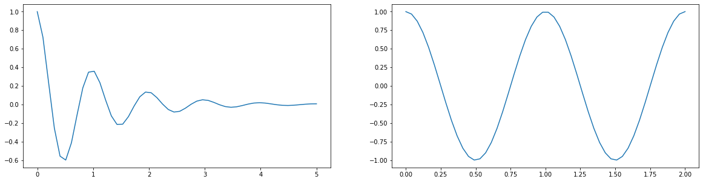
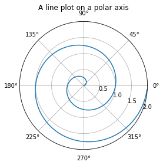
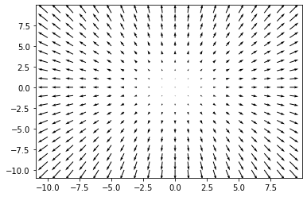

# Section A

Let's discuss manifolds. We're going to be pictoral and stay mostly with this, then we're going to get specific and examine some of these ideas in lcoal coordinates, symbolically. We will come right up to, but won't explciitly define, curvature. 

# Let's discuss it

$$
c = \sqrt{a^2 + b^2}
$$


# Utlity scripts for plotly

These examples use the python version of plotly in a collab notebook. Here are some convenience functions I wrote you can copy to make things easier. All code examples below call these convenience functions 
<details><summary>Expand convenience functions</summary>
<p>

## Making graphs prettier and enabling SVG rendering

```python
# utility code for dif geo examples in python/plotly

def prettify(fig):
  fig.update_layout(scene = dict(
                    #bgcolor='rgb(0,0,0,0)',
                    xaxis = dict(
                         visible=False,
                          showticklabels=False,
                          showaxeslabels=False,
                          backgroundcolor="rgba(255, 255, 255,1)",
                          gridcolor="white",
                          showbackground=True,
                          zerolinecolor="white",
                        showgrid=False),
                    yaxis = dict(
                        visible=False,
                        showticklabels=False,
                        backgroundcolor="rgba(255, 255, 255,1)",
                        showgrid=False),
                    zaxis = dict(
                        visible=False,
                        showticklabels=False,
                        backgroundcolor="rgba(255, 255, 255,1)",
                        showgrid=False,
                        ),),
                    width=700,
                    margin=dict(r=10, l=10, b=10, t=10),
                    
                      paper_bgcolor='rgba(255,255,255,1)',
                       plot_bgcolor='rgba(0,0,0,1)',
             
                  )
  fig.update_coloraxes(showscale=False)
  return fig

def SVGConfig():
  config = {
  'toImageButtonOptions': {
    'format': 'svg', # one of png, svg, jpeg, webp
    'filename': 'custom_image',
    'scale': 1 # Multiply title/legend/axis/canvas sizes by this factor
  }
  }
  return config
```

</p>
</details>

    

    


    

    


    

    
# Surface and Curve


So we can draw our manifold from a chart. And we can draw a curve in cartesian space, and use the inverse chart map to lift the curve to lie on the manifold.

